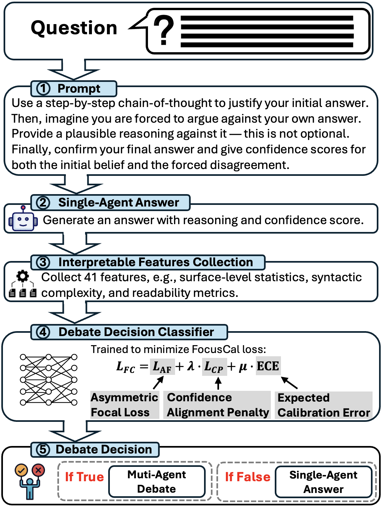

# [AAAI'26] iMAD: Intelligent Multi-Agent Debate for Efficient and Accurate LLM Inference

## Abstract
Large Language Model (LLM) agent systems have advanced rapidly, especially in zero-shot settings. To further improve reasoning and accuracy on complex tasks, Multi-Agent Debate (MAD) engages multiple LLM agents in structured debates to encourage diverse reasoning. However, triggering MAD for every query is inefficient: it incurs substantial token cost and can even degrade accuracy by overturning correct single-agent answers. To address this limitation, we propose intelligent Multi-Agent Debate (iMAD), a token-efficient framework that selectively triggers MAD only when it is likely to be beneficial (that is, when it will correct an initially wrong answer). iMAD learns generalizable model behavior to make accurate debate decisions. It first prompts a single agent to produce a structured self-critique response, from which we extract 41 interpretable linguistic and semantic features that capture hesitation cues. A lightweight debate-decision classifier, trained with our proposed FocusCal loss, then decides whether to trigger MAD, enabling robust debate decisions without test dataset specific tuning. Across six (visual) question answering datasets and five competitive baselines, iMAD reduces token usage by up to 92% while improving final answer accuracy by up to 13.5%.

<p align="center">
  
</p>

## 🚀 Features

- 🧠 Selective Multi-Agent Debate controlled by a lightweight classifier  
- 🧮 FocusCal loss for calibrated and uncertainty-aware debate triggering  
- 📊 Automatic class balancing options (SMOTE or random undersampling)  
- 🔧 Fully configurable via command line  
- 📈 Train and test metrics with ROC-AUC and confusion matrices  
- 🗂️ Automatic result logging and model checkpoint saving  

## 📦 Installation

```bash
conda create -n imad python=3.10
conda activate imad
pip install -r requirements.txt
```
Python 3.12.6 is recommended.

## 📁 Project Structure

```
.
├── Classfier.py      # Main training script
├── DataLoader.py     # Data loading utilities
├── Model.py          # MLP2Head definition
├── Losses.py         # iMAD FocusCal loss functions
└── Results/          # CSV logs
```

## ▶️ Quick Start

### Run with defaults

```bash
python Classfier.py
```

### Example with full custom settings

```bash
python Classfier.py   --Model MLP2HEAD     --lossName FocusCalLoss   --Nlayers 6   --hidden_dim 200   --epochs 20   --Learningrate 0.001   --Sampler SMOTE   --Scaller standard   --ClassWeights True
```

## ⚙️ Command-Line Arguments

### Model & Dataset

| Argument | Default | Choices | Description |
|---------|---------|---------|-------------|
| --datapath | Dataset | - | Directory path of dataset |
| --Data | stat_self_critique | stat_self_critique | Dataset name |
| --confcolumn | InitialConfidence | - | Confidence column name |

### Training

| Argument | Default | Choices | Description |
|---------|---------|---------|-------------|
| --Nlayers | 5 | 2–5 | Number of MLP layers |
| --hidden_dim | 200 | 200/500/1000 | Hidden layer size |
| --dropout_rate | 0.2 | - | Dropout |
| --use_batchnorm | True | True/False | Use BatchNorm |
| --Learningrate | 0.001 | - | Learning rate |
| --epochs | 50 | - | Epochs |

### Preprocessing

| Argument | Default | Choices | Description |
|---------|---------|---------|-------------|
| --Sampler | none | SMOTE/RandomUnderSampler/none | Imbalance handling |
| --Scaler | standard | standard/minmax/none | Feature scaling |
| --ClassWeights | False | True/False | Weighted loss |

### FocusCalLoss Parameters

| Argument | Default | Description |
|----------|---------|-------------|
| --alpha_pos | 1.0 | Positive weight |
| --alpha_neg | 2.0 | Negative weight |
| --gamma | 2 | Focusing parameter |
| --lambda_cp | 6 | Regularization term |
| --mu_ece | 5 | Calibration loss weight |
| --tau | 0.7 | Temperature scaling |
| --n_bins | 15 | ECE bins |


## 📤 Output

- **Models** saved in `DLModels/Model_{EXP}.pt`
- **Scalers** saved as `.joblib`
- **Results CSV** in `Results/DLLResults.csv`  
  Includes accuracy, precision, recall, F1, ROC‑AUC, confusion matrix.

